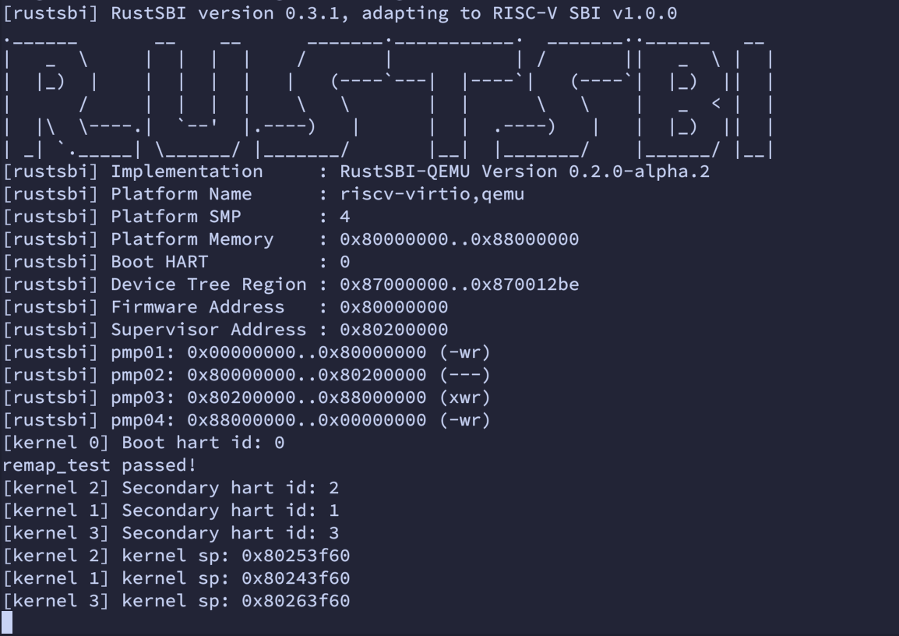

# 4.2 OS 比赛交流

## 多核启动

陈嘉钰

---

# 参考其他OS的启动方式

所有的内核都会进入`_start`中，需要在`_start`中选出某一核作为主核。
在主核执行相关任务时，其他核应等待。

选定主核
- 硬编码启动核的`hart_id`。
- 使用`mutex`或`atomic bool`，抢占式地选定一个启动核。

从核等待
- 忙等：检查`atomic bool`的值
- 从核`wfi` + 主核`ipi`

---

# 参考其他OS的启动方式

aCore

```rust
static AP_CAN_INIT: AtomicBool = AtomicBool::new(false);
let cpu_id = arch::cpu::id();
if cpu_id == config::BOOTSTRAP_CPU_ID {
    // main hart init ...
    AP_CAN_INIT.store(true, Ordering::Release);
} else {
    // wait for main hart
    while !AP_CAN_INIT.load(Ordering::Acquire) {
        spin_loop_hint();
    }
    // ...
}
```

---

# 参考其他OS的启动方式

UltraOS

```rust
pub fn rust_main() -> ! {
    let core = id();

    if core != 0 {
        // Secondary harts wating
        // Compiles to WFI
        loop{}

        // Secondary harts init ...

        task::run_tasks();
        panic!("Unreachable in rust_main!");
    }

    // main hart (id = 0) init ...

    sbi_send_ipi(&mask as *const usize as usize);

    task::run_tasks();
    panic!("Unreachable in rust_main!");
}
```

---

# SBI 的 HSM 扩展

Hart Status Management

开启HSM扩展的SBI，仅启动1个`hart`进入内核中（`Running`）。
其他`hart`为`Suspend`状态（执行`wfi`命令，等待主核的`ipi`唤醒）。

- `sbi_rt::hart_get_status(hart_id)`：查询其他`hart`的状态

- `sbi_rt::hart_start(hart_id, entry_addr, opaque)`：启动其他`hart`

---

# 获取 hart 总数

SBI 调用系统内核时，会在`a1`传入`Device tree`结构体的地址。

```rust
fn get_hart_count(dt_addr: usize) -> usize {
    let dev_tree = unsafe {
        DevTree::from_raw_pointer(dt_addr as *const u8).expect("Error parsing Device tree.")
    };

    let mut hart_count = 0;
    dev_tree
        .nodes()
        .for_each(|node| {
            if node.name().unwrap().starts_with("cpu@") {
                hart_count += 1;
            }
            Ok(())
        })
        .unwrap();

    hart_count
}

pub fn rust_main(hart_id: usize, dt_addr: usize) -> ! {
    // ...
    for id in 0..get_hart_count(dt_addr) {
        if id != hart_id {
            sbi_rt::hart_start(id, secondary_entry as usize, 0);
        }
    }
    // ...
}
```

---

# 启动流程

使用最新的`RustSBI`（带有`HSM`扩展）。

1. 任意核作为`main hart`，进入`_start`并传入其`hart_id`与`DTB address`。

2. 主核执行清零`bss`、初始化页表、初始化页帧分配器、堆分配器等任务。
3. 通过查询`Device Tree`中的信息，获取`hart`总数。
4. 唤醒`secondary hart`，进入`secondary_entry`，执行部分初始化任务（设置内核栈、开启内核页表等）。
5. `run::tasks`。

---

# 为`print`增加互斥锁

不同`hart`在同时输出时，得到未被打乱的结果。

```rust
pub static WRITING: AtomicBool = AtomicBool::new(false);

#[macro_export]
macro_rules! println {
    ($fmt: literal $(, $($arg: tt)+)?) => {
        while let Err(_) = $crate::console::WRITING.compare_exchange(
            false,
            true,
            core::sync::atomic::Ordering::Relaxed,
            core::sync::atomic::Ordering::Relaxed
        ) {}

        $crate::console::print(format_args!(concat!($fmt, "\n") $(, $($arg)+)?));

        $crate::console::WRITING.store(false, core::sync::atomic::Ordering::Relaxed);
    }
}
```

---

# `naked`函数特性

```rust
// 16pages, 64kb
const KERNEL_STACK_SIZE: usize = 4096 * 16;
const SMP_MAX_NUM: usize = 4;

#[link_section = ".bss.stack"]
static KERNEL_STACK: [u8; KERNEL_STACK_SIZE * SMP_MAX_NUM] = [0; KERNEL_STACK_SIZE * SMP_MAX_NUM];

/// set sp to kernel_stack + (hart_id + 1) * kernel_stack_size
/// a0: hart_id
#[naked]
unsafe extern "C" fn set_kernel_stack(hart_id: usize) {
    asm!(
        "addi t0, a0, 1",
        "li t1, {}",
        "mul t1, t1, t0",

        "la sp, {}",
        "add sp, sp, t1",
        "ret",
        const KERNEL_STACK_SIZE,
        sym KERNEL_STACK,
        options(noreturn)
    )
}

```

---

# `naked` 主核启动

```rust
#[naked]
#[link_section = ".text.entry"]
#[export_name = "_start"]
unsafe extern "C" fn main_entry(hart_id: usize, dt_addr: usize) {
    asm!("call {}", "tail {}", sym set_kernel_stack, sym rust_main, options(noreturn))
}

/// the entry point for main hart
/// a0: hart it
/// a1: address of device tree
#[no_mangle]
pub fn rust_main(hart_id: usize, dt_addr: usize) -> ! {
    println!("[kernel {0}] Boot hart id: {0}", hart_id);

    clear_bss();
    logging::init();

    mm::init();
    mm::enable_kernel_page_table();
    mm::remap_test();

    trap::init();

    // ipi wake secondary harts.
    for id in 0..get_hart_count(dt_addr) {
        if id != hart_id {
            sbi_rt::hart_start(id, secondary_entry as usize, 0);
        }
    }

    unsafe {
        wfi();
    }
}

```

---

# `naked` 从核启动

```rust
/// a0: hart_id
#[naked]
unsafe extern "C" fn secondary_entry(hart_id: usize) -> ! {
    asm!(
        "call {}",

        "tail {}",
        sym set_kernel_stack,
        sym start_kernel_secondary,
        options(noreturn)
    )
}

/// Start secondary kernels
#[no_mangle]
pub extern "C" fn start_kernel_secondary(hart_id: usize) {
    println!("[kernel {0}] Secondary hart id: {0}", hart_id);
    mm::enable_kernel_page_table();

    trap::init();

    unsafe {
        let sp: usize;
        asm!("mv {}, sp", out(reg) sp);
        println!("[kernel {}] kernel sp: {:#x}", hart_id, sp);
    }

    unsafe {
        wfi();
    }
}
```

---



---

# 接下来的目标

- 完成多核OS的后续部分，运行`ch6`test。

- 学习如何处理内核中接收到的中断。参考：`Maturin`
