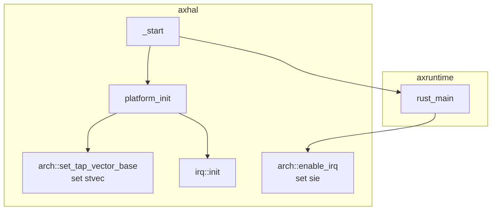
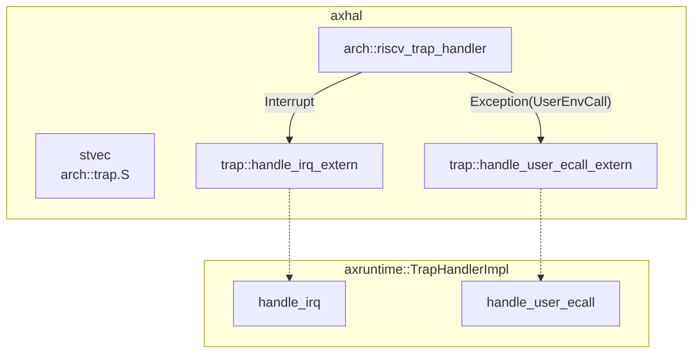
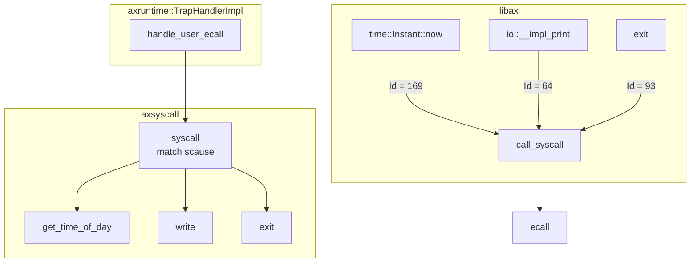

# 第 3 周

## U 特权级

陈嘉钰

---

# 何时切换？
##

参考 rCore：

- 在 Trap 时切换到`S`

- 在 Trap Return 中从`S`切换至`U`

ArceOS：

- Trap / Return 时切换

- 在`rust_main()`中调用用户`main()`时切换至`U`

---

# 单任务
##

- 由`libax`暴露`_user_start`，调用用户的`main`

- 临时生成一个 `TrapFrame`，修改 `sstatus` 与 `sepc` 后 `sret`

```rust
#[no_mangle]
extern "C" fn _user_start() {
    extern "Rust" {
        fn main() -> i32;
    }

    let return_value = unsafe { main() };
    exit(return_value);
}
```

---

# 启动

- 临时生成一个 `TrapFrame`，修改 `sstatus` 与 `sepc` 后 `sret`。
- 内核与用户栈

``` rust
pub fn enter_user() -> ! {
    static KERNEL_STACK: [u8; TASK_STACK_SIZE] = [0; TASK_STACK_SIZE];
    static USER_STACK: [u8; TASK_STACK_SIZE] = [0; TASK_STACK_SIZE];

    let mut trap_frame = TrapFrame::default();
    trap_frame.regs.sp = USER_STACK.as_ptr() as usize + TASK_STACK_SIZE;
    trap_frame.sepc = _user_start as usize;

    // set SPP to User
    let sstatus_reg = sstatus::read();
    trap_frame.sstatus = unsafe { *(&sstatus_reg as *const Sstatus as *const usize) & !(1 << 8) };

    unsafe {
        asm!(
            // ...
            "sret",
            // ...
        );
    }
}
```

---

# 地址空间
##

如果使用页表，需将应用内存单独标记为`U`。

- `S mode` 下不可执行`U`页表中的指令

- `S mode` 下不可访问`U`页表中的内存，（可用 `sstatus` 中的 `SUM` 字段开启）

内核与应用可以使用一个页表，但不能只用一个大页。

目前的 ArceOS 将内核与应用的代码均放在 `.text` 段中，不便分开。
（所以先关闭页表）

希望采用`Maturin`的方法，内核与应用共用同一个页表。

## Tramploline

在共用的页表中，切换特权级不涉及切换页表，无需考虑平滑性。

---

# Trap
##

Init:



---

Trap Handle:



---

Syscall:



---

# syscall 用户测例
##

```toml
[dependencies]
libax = { path = "../../../ulib/libax", features = ["syscall", "alloc"] }
```

```rust
#![no_std]
#![no_main]

// Build with libax to get global_allocator and stuff.
#[macro_use]
extern crate libax;

use libax::time::Instant;

#[no_mangle]
fn main() -> i32 {
    let t = Instant::now();

    println!("Hello, world!. It's {:?}", t);

    0
}
```

---

# ArceOS 的内存布局
##

由 `axconfig` 提供 `KERNEL_BASE_PADDR` 和 `KERNEL_BASE_VADDR`。

编译时，ArceOS 把自己放在 `KERNEL_BASE_VADDR` 的位置。

启动时，设置两个 `1G` 的大页表，将 `VADDR` 和 `PADDR` 均映射至 `PADDR`。
跳转至 `VADDR` 开始执行。

---

## `paging` feature

`remap_kernel_memory()`，创建一个新的页表，将各内存段重新映射至 `4KB` 的小页。
使用新的页表。

## `alloc` feature

使用小页映射，分配内存页。

---

# NPUcore
##

整体结构与`rCore`类似。

- 内核功能支持，支持`bash`

- 文件系统相关的文档

- `Directory Tree`

---

# 后续的计划
##

1. 分离用户应用与系统的编译，将`app`镜像加载至系统中（rCore）

2. 启用页表，`app`与`kernel`共用一个页表（Maturin）

3. 建立进程与线程的抽象。
