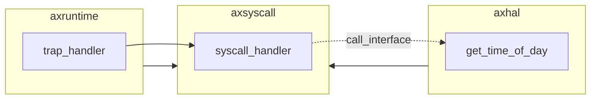
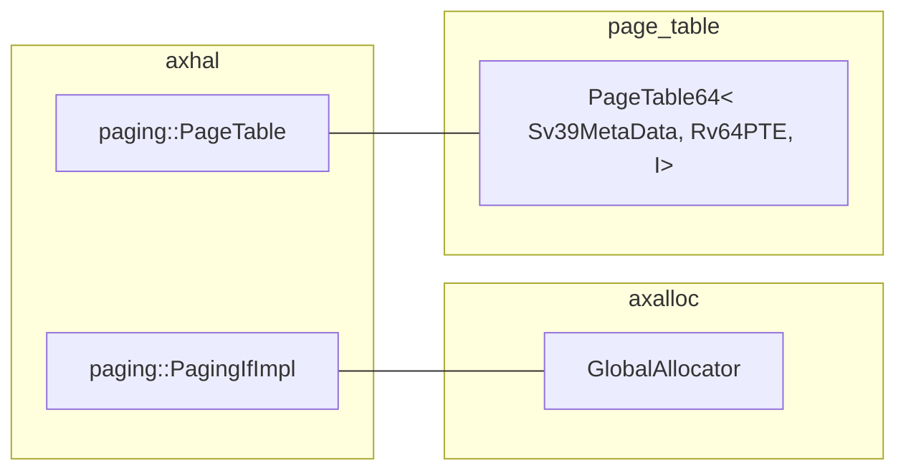

# 第 4 周

## 进程/线程、页表

陈嘉钰

---

# 移除 `axsyscall` 对其他模块的直接依赖

使用 `crate-interface` 实现

- `axsyscall` 中定义处理部分 `syscall` 的 `trait`，如：`trait SyscallTime`

- 其他 `ax*` 模块提供具体实现（`axhal::time` 中的 `SyscallTimeImpl`）

- `axsyscall` 使用 `crate-interface` 调用其他模块处理 `syscall`

```rust
```

---



- 其余模块（如 `axprocess`）可依赖于 `axsyscall` 并实现相关的 `trait`

- 由 `axruntime` 配置锁需要的模块，链接 `syscall` 的具体实现

- 耦合程度轻，但关系较为混乱

---

# 加载 App


## 编译/链接

参考 `rCore`

- 编译应用获得 `elf` 文件
- 由内核的 `build.rs` 生成 `link_app.S`，使用 `.incbin` 导入应用 `elf` 文件
- `axruntime` 中使用 `global_asm!(include_str!("link_app.S"))`

## 加载

- `link_app.S` 中会记录应用内存段的始末、名称
- 由对应的内存段生成 `MemorySet`（页表），标记为`U`，即为「加载」应用

*编译仍然会得到一个统一的 `elf`，应用仍位于内核中，但生成的 `U` 页表可供应用使用*

---

# 页表

内核与应用共用一个页表

`page_table::PageTable64<PagingMetadata, PTE, PagingIf /* allocator */>`



仅需要在 `axhal::context_swtch` 中切换页表。

---

# 单独编译应用

移出 `libax` 中对 `ax*` 模块的依赖

- `libax-syscall` 仅依赖于 `axruntime`

---

# 编译系统

- `axuser` 依赖于 `axruntime`，编译出系统内核

---

# Linux 中的进程/线程管理

- 管理的基本单位为线程（Light Weight Process），进程概念的具体实现为线程组

- main thread: 由用户库调用 `exit_group`，关闭其他线程

- `clone` 系统调用：更自由的配置生成新线程的参数

- process：复制地址空间、fd、生成新的tgid(pid)

- thread：共享地址空间、fd、tgid(pid)

参考 `Maturin`

---

# 接下来的计划

- 实现类似 Linux 的进程管理

- 开始进行初赛的准备
