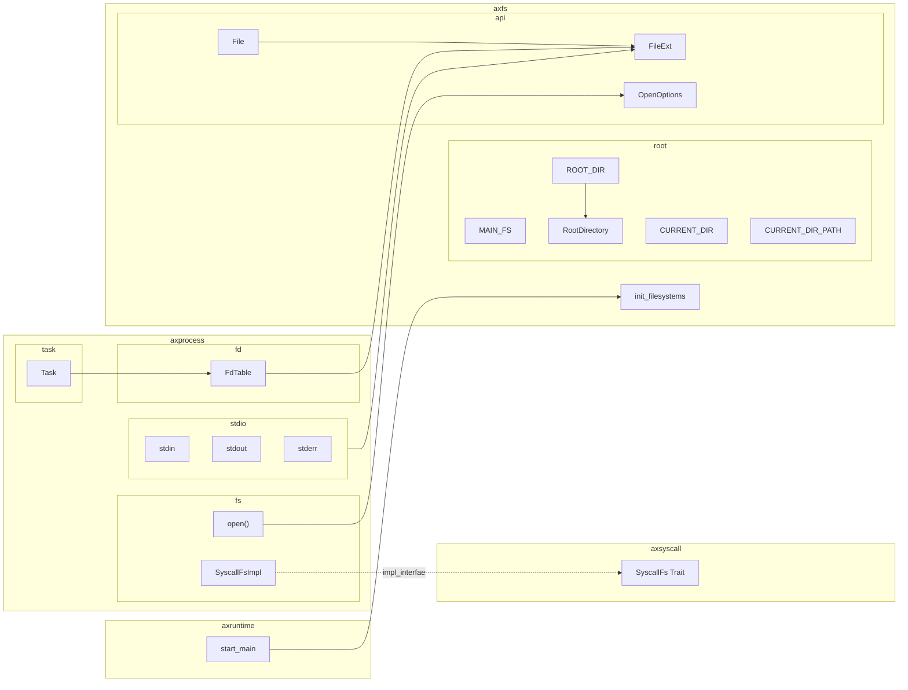

# 第 6 周

## ArceOS 文件系统

陈嘉钰

---

# `axfs`: 提供`Disk`封装与`rootfs`抽象

- `Disk`: `block_id`, `offset` (cursor), `dev` (device)，在当前的实现中是一个virtio block device

- `RootDirectory`: `main_fs`, `mounts`

- `MountPoint`: `path`, `fs`

---

# `axfs_vfs`: 提供`vfs`抽象

- `VfsOps`: 作为`fs`应实现的操作

- `VfsNodeOps`: 作为`fs`中的节点（`inode`）应实现的操作

## `axfs`中提供的`FatFileSystem`实现了`VfsOps`

- `FatFileSystem`: `inner` (由外部依赖提供的`fatfs`，持有一个`Disk`), `root_dir` (一个`VfsNode`)

---

# `axfs`: `api`接口

- `OpenOptions`: 打开文件时的模式

- `File`: 代表打开的文件

## 

---

# 向进程提供文件接口
##

利用`axio`中的`Read`、`Write`、`Seek` Trait定义一个代表文件的`FileExt` Trait。

```rust
trait FileExt: Read + Write + Seek {}

impl FileExt for axfs::api::File
```

## FdTable

```rust
pub struct FdList(Vec<Option<Arc<RefCell<dyn axfs::api::FileExt + Send + Sync>>>>);

struct Task {
    #[cfg(feature = "fs")]
    fd_table: SpinNoIrq<FdList>,
}
```

---

# 对现有ArceOS库的修改

- 在`axfs`中定义`FileExt`并为`axfs::api::File`提供impl

- 添加`OpenOptions::open_at`接口，实现`openat()`系统调用

## 其他修改

- 利用`axfs::api::read`加载elf

- 处理`argc`、`argv` （execve），放入用户栈顶并维护`sp`、`a0`、`a1`

---

# 发现的问题

- `axsync`依赖于`axtask`以查询当前进程的`pid/tid`

- `axfs::api::File`中没有保存`open()`文件时的`flags`

- ArceOS使用全局的static变量`CURRENT_DIR`保存当前的目录，应移至PCB中

---

<Transform :scale=0.7>

</Transform>

---

# 下周的计划

- 实现`execve()`

- 实现`mmap()`、`unmmap()`

- 通过文件系统、进程管理、其他的初赛测例
