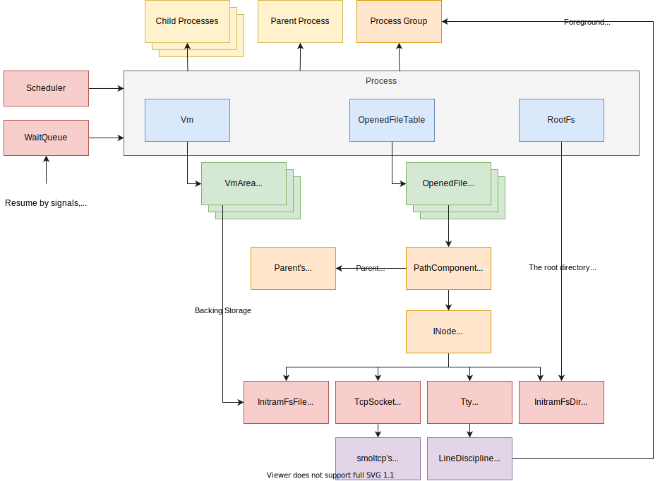
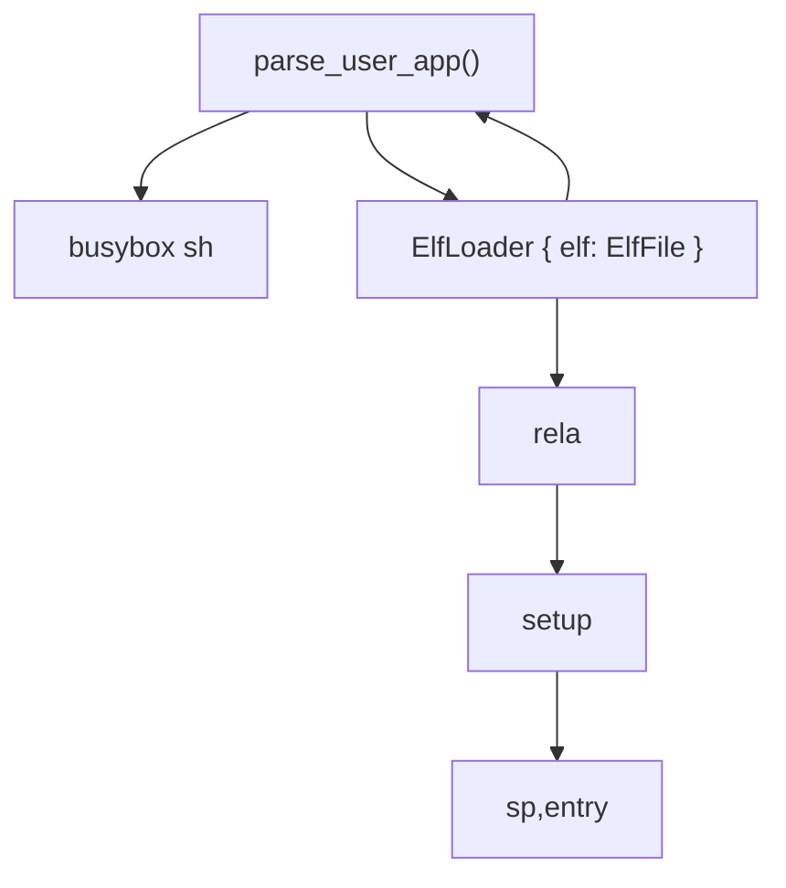

# Kerla

## build 与 运行

build依赖Docker。



- Vm 的部分与Maturin类似，在实现懒加载时可以参考

- Process Group 的设计可以参考

- 与我目前的设计类似，系统中仅存在`Light Weight Process`概念

# Dynamic Linking / Loading

使用动态链接库(.so)的可执行文件，会写入一个类型为`PT_INTERP`的`Program Header`，指定一个Interpreter来处理对动态库的调用。
通常指定的文件也为ELF格式。内核会转而加载Interpreter进入内存，并将需要执行的文件传递给

musl libc在编译后得到的`libc.so`自身既是libc库，又是Interpreter；直接执行这个文件时，作为`ldd`使用。
Maturin中，将需要执行的文件传递给Interpreter的方式是在文件自身以及参数作为`libc.so`的参数。
故`./a.out arg1 arg2`与`/lib/libc.so ./a.out arg1 arg2`具有相同的效果。

ld.so

对于Interpreter的ELF，含有`.rela.*`等需要重定位的section，需要loader负责实现重定位。



```rust
pub fn load(self, args: &[&str]) -> Task {
    if let Some(interp) = self
        .elf
        .program_iter()
        .find(|ph| ph.get_type() == Ok(xmas_elf::program::Type::Interp))
    {
        let interp = match interp.get_data(&self.elf) {
            Ok(SegmentData::Undefined(data)) => data,
            _ => panic!("Invalid data in Interp Elf Program Header"),
        };

        let interp_path = from_utf8(interp).expect("Interpreter path isn't valid UTF-8");
        // remove trailing '\0'
        let interp_path = interp_path.trim_matches(char::from(0));
        info!("Interpreter path: {}", interp_path);

        let mut new_argv = vec![interp_path];
        new_argv.extend_from_slice(args);
        info!("Interpreter args: {:?}", new_argv);

        let interp = axfs::api::read(interp_path).expect("Error reading Interpreter from fs");
        let loader = Loader::new(&interp);
        return loader.load(&new_argv);
    }
    // ...
}
```

## Relocation

处理ELF中的`.rela.dyn`与`.rela.plt`段。一般情况下，静态链接的程序不存在这两段，动态链接的程序使用的Interpreter的ELF可能存在这两段。这时需要处理Relocation。

找到`.rela.*`段后，逐一读取其Relocaiton Table中的entry。并由addend、offset、dynamic symbol等值计算重定位后的结果，写回目标地址。地址的具体计算方式依据不同的重定位类型决定。

```rust
// Relocate .rela.dyn sections
if let Some(rela_dyn) = elf.find_section_by_name(".rela.dyn") {
    let data = match rela_dyn.get_data(&elf) {
        Ok(xmas_elf::sections::SectionData::Rela64(data)) => data,
        _ => panic!("Invalid data in .rela.dyn section"),
    };

    if let Some(dyn_sym_table) = elf.find_section_by_name(".dynsym") {
        let dyn_sym_table = match dyn_sym_table.get_data(&elf) {
            Ok(xmas_elf::sections::SectionData::DynSymbolTable64(dyn_sym_table)) => {
                dyn_sym_table
            }
            _ => panic!("Invalid data in .dynsym section"),
        };

        info!("Relocating .rela.dyn");
        for entry in data {
            match entry.get_type() {
                REL_GOT | REL_PLT | R_RISCV_64 => {
                    let dyn_sym = &dyn_sym_table[entry.get_symbol_table_index() as usize];
                    let sym_val = if dyn_sym.shndx() == 0 {
                        let name = dyn_sym.get_name(&elf).unwrap();
                        panic!(r#"Symbol "{}" not found"#, name);
                    } else {
                        base_addr + dyn_sym.value() as usize
                    };

                    let value = sym_val + entry.get_addend() as usize;
                    let addr = base_addr + entry.get_offset() as usize;

                    info!("relocating: addr 0x{:x}", addr);

                    unsafe {
                        copy_nonoverlapping(
                            value.to_ne_bytes().as_ptr(),
                            addr as *mut u8,
                            size_of::<usize>() / size_of::<u8>(),
                        );
                    }
                }
                REL_RELATIVE | R_RISCV_RELATIVE => {
                    let value = base_addr + entry.get_addend() as usize;
                    let addr = base_addr + entry.get_offset() as usize;

                    info!("relocating: addr 0x{:x}", addr);

                    unsafe {
                        copy_nonoverlapping(
                            value.to_ne_bytes().as_ptr(),
                            addr as *mut u8,
                            size_of::<usize>() / size_of::<u8>(),
                        );
                    }
                }
                other => panic!("Unknown relocation type: {}", other),
            }
        }
    }
}
```

与静态loader相比，Dynamic Linker / Loader只多出了以下内容：

- 判断是否使用Interpreter，修改args后用Interpreter的ELF文件构建内存。

- 对于ELF中的`.rela.*`段进行重定位

- ELF文件中的多个段在文件中是连续的，为保证对齐，在内存中不是

## 处理args、envs、auxv

初赛的测例库对args的传入方式与ArceOS原有的不同。

```c++
extern int main();

int __start_main(long *p)
{
	int argc = p[0];
	char **argv = (void *)(p+1);

	exit(main(argc, argv));
	return 0;
}
```

需把argc与args放在连续的内存中，并传递argc的地址。

`musl`库对于args的存放也有一定的需求，暂时不明确。`dlstart.c`中存放了启动时的处理代码。

## 需要的系统调用

- open (O_RDONLY | O_NOFOLLOW) / read / close

- writev

- mmap / munmap

# 目前存在的问题 / 下一周的工作

- syscall 未实现，无法进一步测试

- 在本机搭建rust的riscv64gc-unknown-linux-musl toolchain

- 再深入理解一下各类型重定义的含义

- 整理loader相关代码 (&[u8] / xmas_elf::ElfFile (axprocess) --> MemorySet (axmem))

- ArceOS 原有的部分依赖于其对虚拟地址与物理地址间关系
